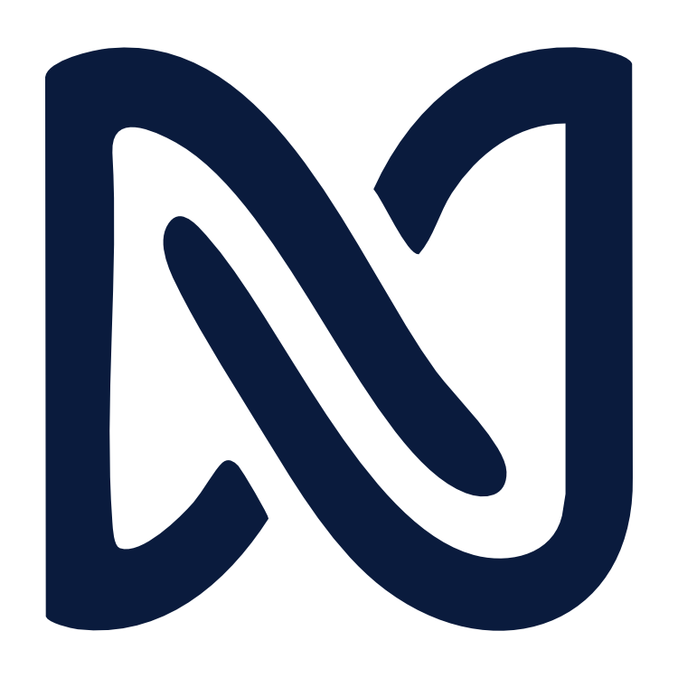

# Neurality

### Real-time neural embeddings for AI

**Foundation model and application programming interface (API) for event-grounded electroencephalography (EEG).**

---

Most teams working on EEG ship predictions. Neurality ships representations.

We train on the full set of publicly available EEG recordings, at a scale no single dataset provides, and return event-grounded neural embeddings that downstream AI systems fine-tune for their own use cases.

## Contact

- Press and partnerships: `hello@neurality.dev`
- Founder: [Yahya Shirazi](https://github.com/neuromechanist)

---

Neurality is a stealth-phase company. Public artifacts are limited by design.
